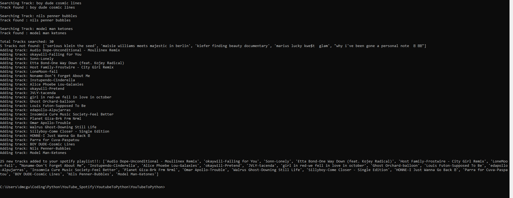

# YouTubeToPython

This is a simple Python script that looks at a YouTube Channel,
and subsequently take the video titles and create a
search within Spotify for the artist and title, and then finally add this
YouTube playlist to a custom made Spotify playlist.

Example of working code:

ERRORS AND NOTES
-Was receiving an Error 403 regarding the spotify api for the longest time.
This was fixed by making my spotify playlist a private playlist

-Encoding error fixed by including the code : 'encoding = utf-8'

-Right now the program will take in the MAX_RESULT and if a previous search has
 not been cleared, the program will return an error
      " IndexError: list index out of range "

-Current iteration will duplicate songs in the playlist if that song has
 already been added (It should ignore duplicates)

-The search.csv file needs to be cleared before excuting the script.
 It contains previous searches
